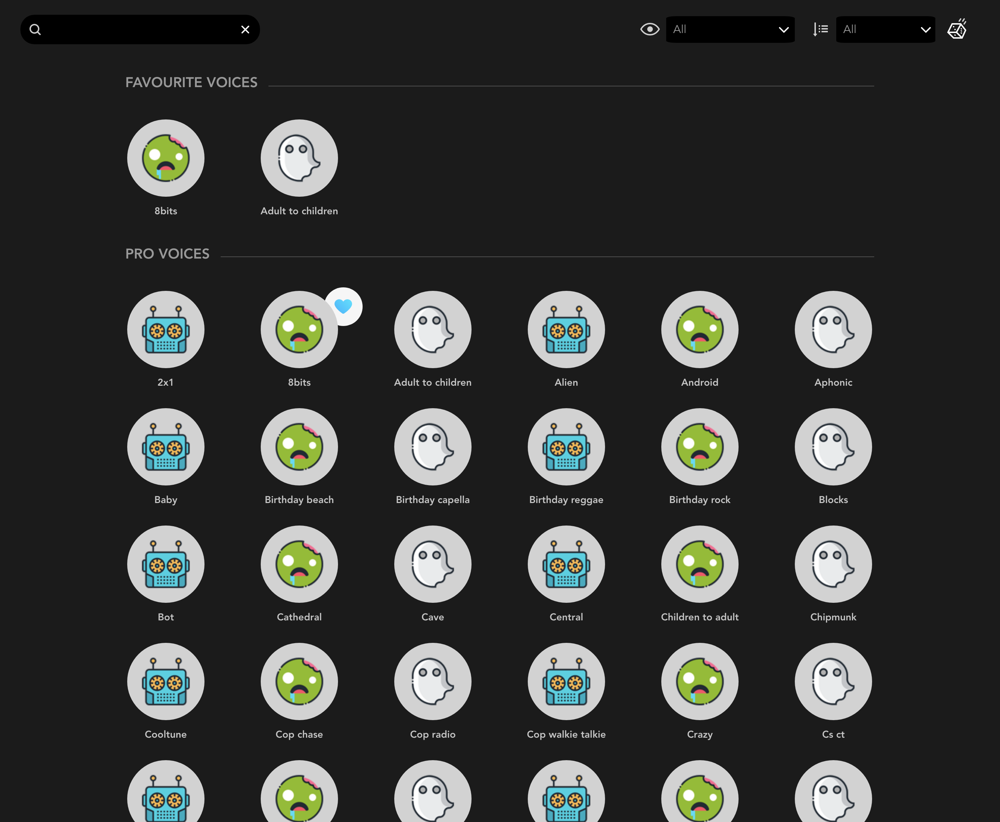

# Voicemod test

This is a web app test that displays a given set of voices according to a specific design. The design in question: [https://invis.io/E5VX4173GCV](https://invis.io/E5VX4173GCV)

It features the possibility of searching for a voice, filtering based on their categories and ordering them alphabetically.

It also allows the user to save voices as a favourite and remove them from the favourite list.

## Example screenshot

